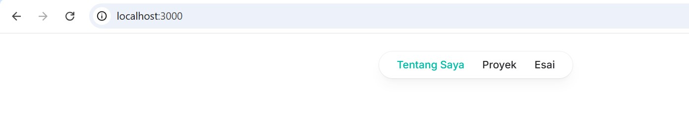
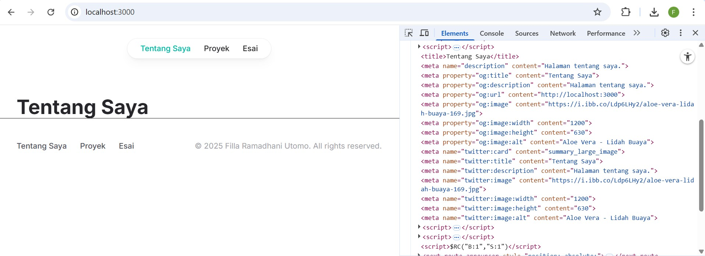
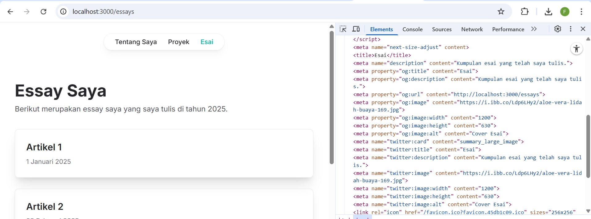
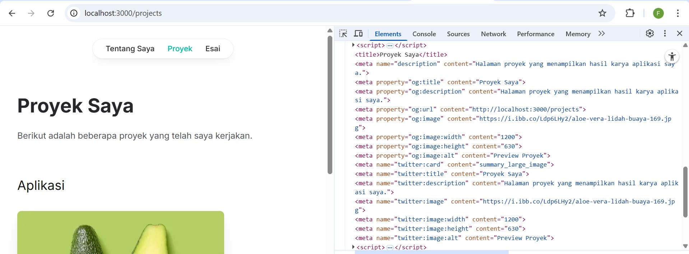

# Week 10 - Membuat Halaman yang SEO-Friendly dengan Next.js

**Nama :** Filla Ramadhani Utomo<br>
**NIM :** 2241720209<br>
**Kelas :** TI-3B<br>
**Absen :** 09

## Langkah Praktikum
## 1. Memahami Pentingnya SEO
SEO (Search Engine Optimization) adalah praktik mengoptimalkan website agar mudah ditemukan oleh mesin pencari seperti Google. Dengan SEO yang baik, website Anda akan lebih mudah muncul di hasil pencarian, sehingga meningkatkan traffic pengunjung.
Beberapa elemen penting dalam SEO:

•	Title Tag: Judul halaman yang muncul di hasil pencarian.

•	Meta Description: Deskripsi singkat tentang halaman.

•	Heading Tags (H1, H2, dll.): Struktur konten yang membantu mesin pencari memahami isi halaman.

•	URL Structure: URL yang deskriptif dan mudah dibaca.

•	Open Graph Tags: Metadata untuk media sosial seperti Facebook dan Twitter.

•	Favicon: Ikon kecil yang muncul di tab browser.


## 2. Menambahkan Favicon



## 3. Menambahkan Metadata untuk SEO

src/utils/metadata.ts 

```tsx
export const defaultMetadata = {
  title: "Website Pribadi",
  description: "Website pribadi untuk menampilkan proyek dan esai.",
  openGraph: {
    url: "http://localhost:3000",
    images: [
      {
        url: "https://i.ibb.co/Ldp6LHy2/aloe-vera-lidah-buaya-169.jpg",
        width: 1200,
        height: 630,
        alt: "Aloe Vera - Lidah Buaya",
      }
    ],
  },
};
```

src/components/layout.tsx 

```tsx
import Head from 'next/head';
import Navbar from './navbar';
import Footer from './footer';
import { defaultMetadata } from '../utils/metadata';

type LayoutProps = {
    children: React.ReactNode;
};

export default function Layout({ children }: any) {
    const metadata = children.props.metadata || defaultMetadata;

    return (
    <>
    <Head>
        <link rel="icon" href="/favicon.ico" />
        <title>{metadata.title}</title>
        <meta name="description" content={metadata.description} />
        {/* Open Graph Tags */}
        <meta property="og:title" content={metadata.title} />
        <meta property="og:description" content={metadata.description} />
        <meta property="og:image" content={metadata.openGraph.images[0].url} />
        <meta property="og:url" content={metadata.openGraph.url} />
    </Head>
    <Navbar />
    <main>{children}</main>
    <Footer />
    </>
    );
}
```

## Menguji SEO

o Untuk halaman "Tentang Saya".


o Untuk halaman "Esai".


o Untuk halaman "Proyek".


